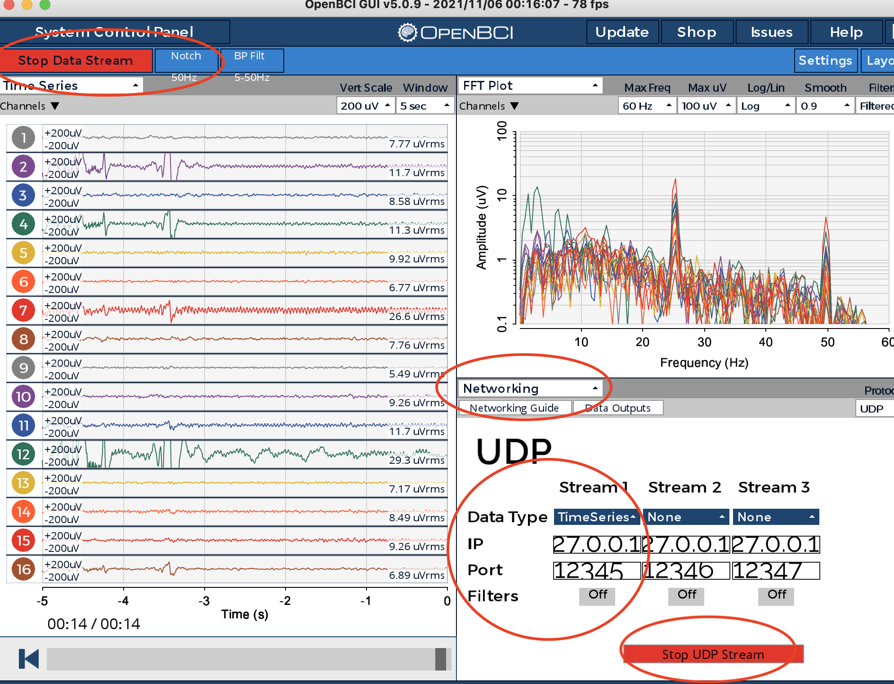

# OpenBCI Hand Data Collector

1. Open OpenBCI GUI 
	- Start Data Stream
	- Networking bar -> Protocol UDP -> Stream TimeSeries
	- Default IP:Port are 127.0.0.1:12345
	- Start UDP Stream
    - 
2. `python data_coll.py -u user_name`
	 params. 
	- \-u username result save at "bci_data/username/*.csv"
	- \-p UDP port (default 12345)
	- \-\-ip UDP ip address (default 127.0.0.1)
	- \-n number of loop (default 3)
	- \-\-width GUI width size
	- \-\-height GUI height size
3. Press KEY (L, R, B, F) for record
